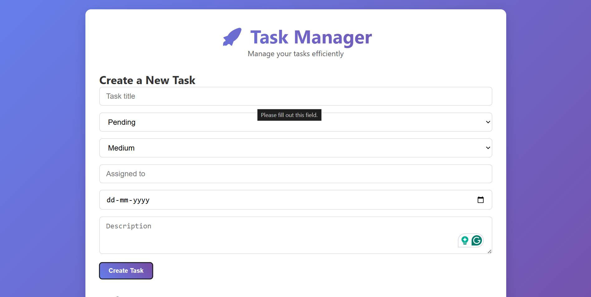

# 🚀 Task Manager API + Web UI

A full-stack task manager application built using **Flask**, **MongoDB**, and modern **HTML/CSS/JavaScript** for seamless task management. Users can create, view, update, and delete tasks both from the UI and API.

---

## 🧱 Features

- ✅ RESTful API with Flask
- ✅ MongoDB as the backend database
- ✅ Responsive UI using HTML/CSS/JavaScript
- ✅ Real-time updates without page reloads
- ✅ Status and priority filters
- ✅ Postman collection support

---

## 🗂️ Project Structure

```
task-manager-app/
├── flask_api_server.py       # Main Flask server
├── .env                      # Environment variables (not tracked by Git)
├── .gitignore                # Ignored files/folders
├── requirements.txt          # Python package dependencies
│
├── docs/
│   ├── index.html
│   ├── style.css             # CSS styling
│   └── script.js             # Frontend logic (JS)           # Frontend HTML (Jinja2)

    
```
---

## 🖼️ UI Preview

Here’s what the Task Manager looks like:




---

## ⚙️ Setup Instructions

### 1️⃣ Clone the repository

```bash
git clone https://github.com/your-username/task-manager-app.git
cd task-manager-app
```

### 2️⃣ Create virtual environment and activate it

```bash
python -m venv .venv
source .venv/bin/activate      # On Windows: .venv\Scripts\activate
```

### 3️⃣ Install dependencies

```bash
pip install -r requirements.txt
```

### 4️⃣ Create a `.env` file

```env
MONGO_URI=mongodb://localhost:27017/
PORT=5000
```

> Make sure your MongoDB server is running locally (or use MongoDB Atlas).

### 5️⃣ Run the Flask server

```bash
python flask_api_server.py
```

Then visit: [http://localhost:5000](http://localhost:5000)

---

## 🧪 API Endpoints

| Method | Endpoint             | Description            |
|--------|----------------------|------------------------|
| GET    | `/api/tasks`         | Get all tasks          |
| GET    | `/api/tasks/<id>`    | Get a specific task    |
| POST   | `/api/tasks`         | Create a new task      |
| PUT    | `/api/tasks/<id>`    | Update a task          |
| DELETE | `/api/tasks/<id>`    | Delete a task          |
| GET    | `/api/stats`         | Get task statistics    |

You can test these using [Postman](https://www.postman.com/) or [cURL](https://curl.se/).

---

## 💻 Frontend Features

- Clean UI built with HTML5, CSS3, and Vanilla JS
- Tasks auto-update after creation
- Form validation and user feedback
- Filters for status and priority
- No frameworks — just pure frontend

---

## 🔐 Security Notes

- `.env` is in `.gitignore` and should never be committed.
- Keep credentials and secrets in `.env` only.
- Always use environment variables for production configurations.

---

## 📦 Dependencies

```text
Flask==3.0.3
Flask-Cors==4.0.1
pymongo==4.7.2
python-dotenv==1.0.1
```

Install them with:

```bash
pip install -r requirements.txt
```

---

## 🛠️ Future Improvements

- [ ] User authentication & login
- [ ] Deadline reminders or email alerts
- [ ] Task tagging and search
- [ ] Deploy to Render/Heroku with MongoDB Atlas

---

## 🧑‍💻 Author

Made by **[Sayak](https://github.com/reversiblewizard)**

---

## 🧾 License

This project is open-source under the [MIT License](https://opensource.org/licenses/MIT).
